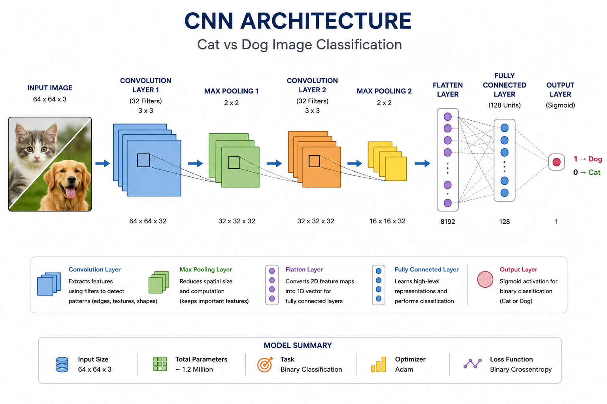

# pet-detection

A Convolutional Neural Network based image classification project for automatic cat and dog recognition. Built using TensorFlow and Keras, the model performs binary image classification through convolution, pooling, and fully connected layers.

<h1 align="center">Pet Detection using CNN</h1>

<h3 align="center">
Cat vs Dog Image Classification using Convolutional Neural Networks
</h3>

<p align="center">
  
  
  
  
</p>

---

## Overview

This project implements a Convolutional Neural Network (CNN) for binary image classification of cats and dogs.

The model learns discriminative visual features through convolution and pooling operations and predicts whether an input image belongs to a cat or dog category.

The framework includes:

* Data Augmentation
* CNN-Based Feature Extraction
* Binary Classification
* TensorFlow & Keras Implementation
* Single Image Prediction

---

## Dataset Information

The project uses the Cats vs Dogs dataset consisting of:

* Training Images
* Testing Images
* Cat Class
* Dog Class

Dataset Structure:

```bash
dataset/
│
├── training_set/
│   ├── cats/
│   └── dogs/
│
├── test_set/
│   ├── cats/
│   └── dogs/
│
└── single_prediction/
```

---

## CNN Architecture

<p align="center">
  
</p>

---

## Workflow Pipeline

```text
Image Dataset
      │
      ▼
Data Augmentation
      │
      ▼
CNN Training
      │
      ▼
Feature Learning
      │
      ▼
Binary Classification
      │
      ▼
Prediction
      │
      ▼
Cat or Dog
```

---

## Project Structure

```bash
pet-detection-cnn/
│
├── assets/
│   ├── interface.png
│   ├── workflow.png
│   └── samples.png
│
├── dataset/
│
├── src/
│   ├── pet_detection.py
│
├── requirements.txt
├── setup.py
├── .gitignore
└── README.md
```

---

## Technologies Used

* Python
* TensorFlow
* Keras
* NumPy
* OpenCV
* Matplotlib

---

## Features

* Binary Image Classification
* Cat vs Dog Recognition
* CNN-Based Feature Learning
* Data Augmentation
* TensorFlow & Keras Implementation
* Single Image Prediction
* End-to-End Deep Learning Pipeline

---

## Installation

```bash
git clone https://github.com/your-username/pet-detection-cnn.git

cd pet-detection-cnn

pip install -r requirements.txt
```

---

## Run the Project

```bash
python src/pet_detection.py
```

---

## Future Improvements

* Transfer Learning Models
* Mobile Deployment
* Multi-Class Pet Classification
* Real-Time Camera Prediction
* Web-Based Interface

---

